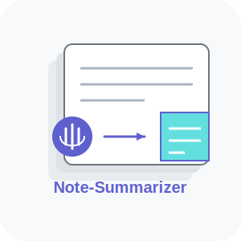

<p align="center">
  
</p>

<h1 align="center">🎙️   Note-Summarizer    📝 </h1>
<p align="center"><strong>Transform Messy Transcripts into Useful Notes</strong></p>

<p align="center">
  <a href="https://github.com/kris-nale314/bytemesumai/blob/main/LICENSE"></a>
  <a href="#"></a>
  <a href="#"></a>
</p>

> **Your meeting transcripts deserve better than a quick skim!** ✨

## 📝 What Is This?

`Note-Summarizer` is a practical tool that turns long meeting transcripts, earnings calls, and other text-heavy content into organized, actionable summaries. It's designed to solve a real problem: helping busy professionals extract meaningful insights from the mountains of text generated in today's workplace.

Whether you're drowning in `Microsoft Teams` meeting transcripts, trying to parse earnings calls for key insights, or making sense of lengthy interviews, Note-Summarizer has you covered!

## 🌟 Why I Built This

If you've ever received a 30-page meeting transcript and thought "I don't have time to read all this..." - you're not alone! 

While tools like `Microsoft Copilot` are making strides in summarization, they often miss critical details, speaker dynamics, and nuances that make the difference between a useful summary and a vague overview.

I built `Note-Summarizer` to apply advanced AI techniques to this everyday problem, creating a practical tool that helps me (and hopefully you!) work more efficiently and effectively.

## 💎 What Makes This Special

- **Intelligent Division Strategies** - Five different approaches to break down documents:
  - ✂️ **Basic**: Smart simple division for any document type
  - 🗣️ **Speaker**: Preserves conversation flow and speaker attribution
  - 📑 **Boundary**: Respects document structure like headings and paragraphs
  - 🧠 **Context-Aware**: Maintains semantic coherence and topical relationships
  - 🔍 **Semantic**: AI-powered chunking that detects natural topic transitions (NEW!)

- **Tiered Processing for Large Documents** - Optimized pipeline for processing very long texts (NEW!)
  - Uses faster models for initial summarization
  - Preserves powerful models for final synthesis
  - Automatically detects when to apply this approach

- **Multi-Document Processing** - Compare and analyze multiple related documents (NEW!)
  - **Earnings Call Comparisons**: Compare financials across multiple companies
  - **Sequential Analysis**: Track company performance over multiple quarters
  - **Cross-Document Synthesis**: Generate insights across related documents

- **Enhanced Visualizations** - Interactive insights to understand your documents (NEW!)
  - Strategy performance comparisons
  - Document structure analysis
  - Smart strategy recommendations

- **Side-by-Side Comparison** - See which strategy works best for your specific content

- **Actionable Results** - Automatically extract tasks, commitments, and follow-up items

- **Interactive Visualizations** - Word clouds and metrics to quickly grasp key themes

## 🚀 Getting Started

### Prerequisites
- Python 3.8+
- OpenAI API key

### Quick Start

```bash
# Clone this repository
git clone https://github.com/Kris-Nale314/note-summarizer.git
cd note-summarizer

# Set up virtual environment
python -m venv venv
source venv/bin/activate  # On Windows: venv\Scripts\activate

# Install dependencies
pip install -r requirements.txt

# Set up your OpenAI API key
echo "OPENAI_API_KEY=your-api-key-here" > .env

# Launch the app
streamlit run app.py
```

### Using Docker

```bash
# Build and run with Docker
docker-compose up -d
```

## 🛠️ The Tech Behind It

Note-Summarizer uses a modular, extensible architecture:

1. **Smart Document Division** - Rather than arbitrary chunks, the app uses intelligent strategies to divide documents in ways that preserve meaning

2. **Advanced Semantic Processing** - Uses AI embeddings to detect natural topic transitions in documents

3. **LLM-Powered Summarization** - Leverages OpenAI's models with carefully crafted prompts specific to each document type

4. **Multi-Stage Processing Pipeline** - Optimized approach for different document sizes and complexities

5. **Adaptable Processing Pipeline** - Customized approaches for different content types (transcripts, articles, technical documents)

6. **Flexible LLM Integration** - Support for OpenAI models with the ability to extend to other providers via LiteLLM

## 💼 Real-World Applications

- **Meeting Follow-ups**: Transform hour-long team meetings into concise action plans
- **Earnings Call Analysis**: Extract key financial insights and executive commentary
- **Research Synthesis**: Condense interviews and discussions into structured findings
- **News Monitoring**: Stay on top of industry news without reading every article
- **Document Review**: Quickly grasp the essence of long reports and documentation
- **Multi-Company Comparison**: Analyze multiple earnings calls to identify industry trends (NEW!)
- **Sequential Analysis**: Track changes across multiple quarters or meetings (NEW!)

## 🧠 Choosing the Right Strategy

Different content types benefit from different division strategies:

- **Meetings & Interviews**: The speaker strategy excels at preserving conversational flow
- **Articles & Reports**: Try the boundary strategy to respect the author's organization
- **Complex Technical Content**: Context-aware often produces the most coherent results
- **Very Long Documents**: Semantic strategy offers the best topic transitions
- **Mixed Content**: Compare all strategies side-by-side to find what works best

## 📜 License

This project is licensed under the MIT License - see the LICENSE file for details.

---

> "The art of communication is the language of leadership." — James Humes

Made with ❤️ to save you time and capture what matters