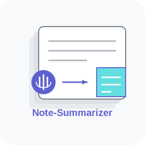

<p align="center">
  
</p>

<h1 align="center">🎙️   Note-Summarizer    📝 </h1>
<p align="center"><strong>Transform Messy Transcripts into Useful Notes</strong></p>

<p align="center">
  <a href="https://github.com/kris-nale314/bytemesumai/blob/main/LICENSE"></a>
  <a href="#"></a>
  <a href="#"></a>
</p>

> **Your meeting transcripts deserve better than a quick skim!** ✨

## 📝 What Is This?

`Note-Summarizer` is a practical tool that turns long meeting transcripts, especially from Microsoft Teams, into organized, actionable summaries. It's designed for busy professionals who need to quickly extract meaningful insights from lengthy meeting text.

The current version focuses on delivering clean, well-structured summaries with minimal complexity, prioritizing core functionality to save you time.

## 🌟 Current Features

- **Context-Aware Summarization** - Automatically detects meeting purpose and important topics
- **Smart Speaker Detection** - Preserves speaker attributions for key points
- **Teams Transcript Optimization** - Specially designed for Microsoft Teams meeting transcripts
- **Customizable Detail Levels** - Choose between brief, standard, or detailed summaries
- **Automatic Action Item Extraction** - Identifies tasks, commitments, and follow-ups
- **Keyword Extraction** - Highlights the most important topics across the transcript
- **Auto-Save Functionality** - Saves summaries with metadata for future reference
- **Clean, Modern Interface** - Easy-to-use design that works in both light and dark modes

## 🚀 Getting Started

### Prerequisites
- Python 3.8+
- OpenAI API key

### Quick Start

```bash
# Clone this repository
git clone https://github.com/Kris-Nale314/note-summarizer.git
cd note-summarizer

# Set up virtual environment
python -m venv venv
source venv/bin/activate  # On Windows: venv\Scripts\activate

# Install dependencies
pip install -r requirements.txt

# Set up your OpenAI API key
echo "OPENAI_API_KEY=your-api-key-here" > .env

# Launch the app
streamlit run app.py
```

## 🛠️ The Tech Behind It

Note-Summarizer uses an innovative, streamlined architecture:

1. **Async Processing** - Processes transcript sections concurrently for faster results
2. **Smart Transcript Splitting** - Special handling for Teams transcript speaker patterns
3. **Two-Pass Analysis** - First analyzes meeting context, then creates focused summaries
4. **Topic Relevance Scoring** - Identifies and prioritizes the most important discussion points
5. **Contextual Synthesis** - Creates summaries focused on meeting purpose and goals

## 🔮 Roadmap & Work in Progress

This is an active development project with several exciting enhancements planned:

- **AI Agent Architecture** - Transitioning to specialized agents for different processing tasks
- **CrewAI Integration** - Implementing CrewAI for coordinated agent collaboration
- **Expanded Document Types** - Adding support for earnings calls, articles, and technical documents
- **Enhanced Interactive Visualizations** - Adding topic networks and importance heatmaps
- **Multi-Document Processing** - Enabling comparison across related documents

## 💼 Real-World Applications

- **Meeting Follow-ups**: Transform hour-long team meetings into concise action plans
- **Knowledge Management**: Create searchable archives of meeting insights
- **Time Savings**: Get the essence of meetings you couldn't attend
- **Team Alignment**: Ensure everyone has the same understanding of discussion outcomes

## 📜 License

This project is licensed under the MIT License - see the LICENSE file for details.

---

> "The art of communication is the language of leadership." — James Humes

Made with ❤️ to save you time and capture what matters